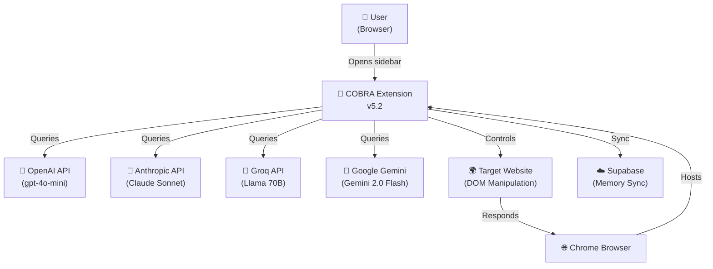
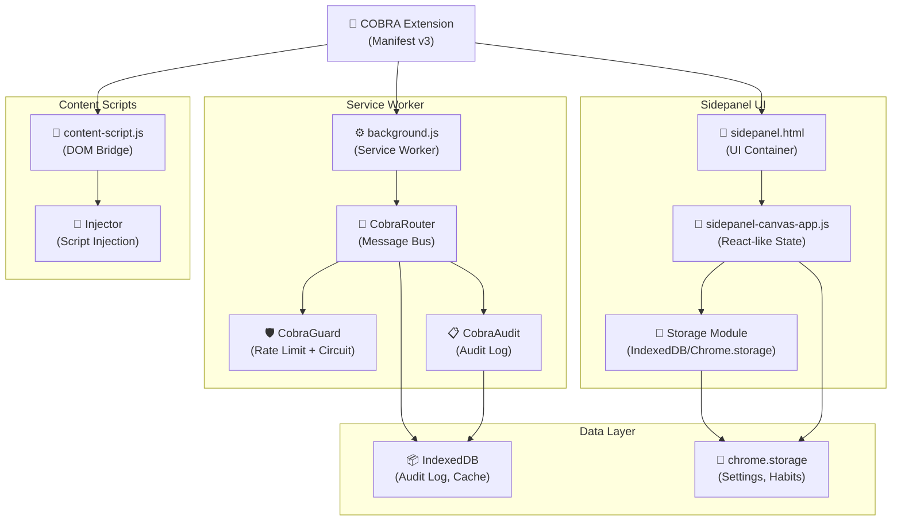
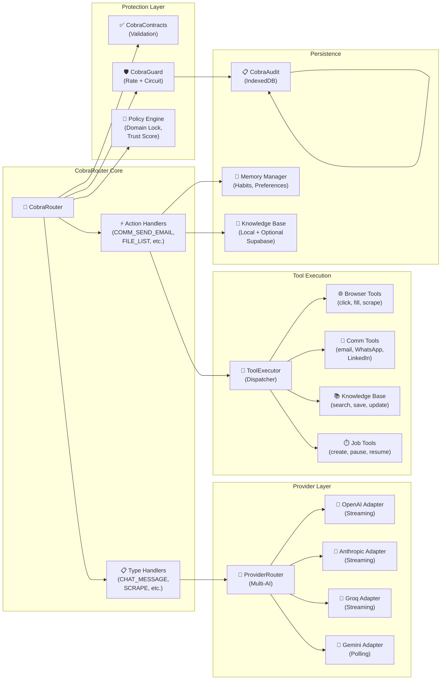
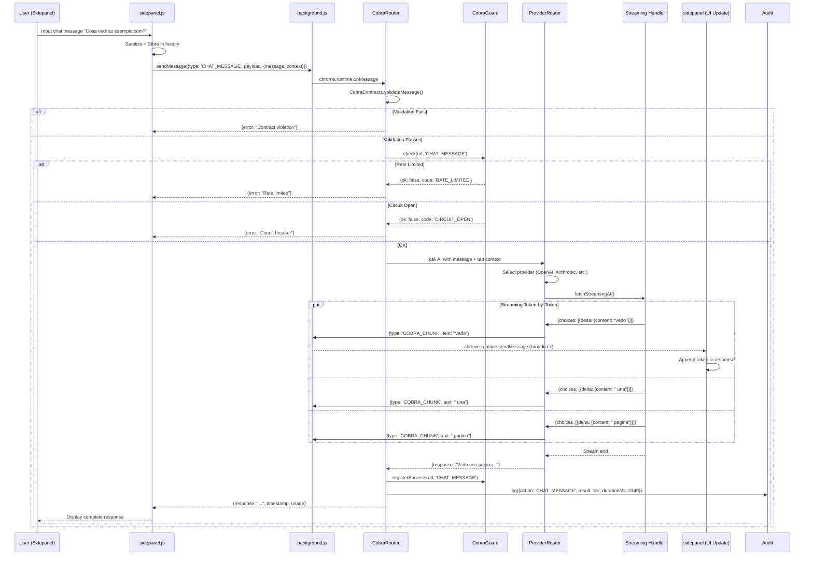

# COBRA v5.2 — Architecture Documentation

## Overview

COBRA (Co-Pilot Browser Orchestration & Reasoning Agent) is an enterprise-grade Chrome extension implementing a modular monolith architecture with a centralized message bus, circuit breaker pattern, and comprehensive audit logging. The system supports multi-provider AI orchestration, browser automation, knowledge base management, and communication hub capabilities.

---

## C4 Model — System Architecture

### Context Diagram



**Key Stakeholders:**
- **User**: Interactive control via sidebar, chat interface, memory management
- **Browser**: Host runtime (Chrome Manifest v3, minimum 114)
- **AI Providers**: Multi-provider strategy with fallback routing
- **Target Website**: Subject of automation and extraction
- **Cloud Sync**: Optional Supabase integration for memory persistence

---

### Container Diagram



**Container Responsibilities:**

| Container | Role | Technology |
|-----------|------|-----------|
| **Service Worker** | Central request dispatcher, AI orchestration, job execution | background.js, Node.js-like API |
| **CobraRouter** | Message broker with contract validation | Function registry, error isolation |
| **CobraGuard** | Rate limiting & circuit breaker enforcement | 10s sliding window, 5-failure threshold |
| **CobraAudit** | Compliance log with 7-day retention | IndexedDB, auto-cleanup |
| **Sidepanel UI** | User interaction, state management, memory/job browsing | HTML5 Canvas, ES6 modules |
| **Storage Module** | Persistent user data (habits, settings, preferences) | chrome.storage.local + IndexedDB |
| **Content Scripts** | DOM access, element selection, form filling | Isolated world, CSP-compliant |
| **IndexedDB** | Structured audit log with indexes | ts, action, category, hostname |

---

### Component Diagram



**Component Coupling:**

| Component | Dependency | Sync/Async | Comment |
|-----------|-----------|-----------|---------|
| CobraRouter | CobraContracts | Sync | Pre-dispatch validation |
| CobraRouter | CobraGuard | Sync | Circuit check before handler |
| CobraRouter | CobraAudit | Async | Fire-and-forget logging |
| ProviderRouter | Each Adapter | Async | Parallel streaming or fallback |
| ToolExecutor | BrowserTools+ | Async | Request-reply with timeouts |
| Guard | Policy | Sync | Policy blocks before rate-check |

---

### Code Sequence — Chat Message Flow with Streaming



**Key Points:**
1. **Validation**: CobraContracts checks message structure
2. **Guard**: Circuit breaker + rate limiter per hostname::action
3. **Multi-Provider**: Fallback chain (OpenAI → Anthropic → Groq → Gemini)
4. **Streaming**: Token-by-token push to sidepanel via broadcast sendMessage
5. **Audit**: Every action logged with timing and result status

---

## Architectural Decisions

### 1. Modular Monolith

**Why?** Single service worker process with dependency injection and message bus.

**Pros:**
- No inter-process overhead (IPC communication is managed)
- Single audit trail
- Easy to test (all modules in same context)

**Cons:**
- Service worker can be suspended; persistent jobs via alarms
- All modules share same memory (leaks possible)

**Mitigation:**
- Periodic memory cleanup
- Background jobs stored in IndexedDB
- Message-based architecture enables future microservices refactor

---

### 2. Message Bus Routing (CobraRouter)

**Why?** Decouple message senders from handlers, enable handler registration from any module.

**Protocol:**
```javascript
// Type-based (COBRA protocol)
{ type: 'CHAT_MESSAGE', payload: {message, context} }
{ type: 'SCRAPE', payload: {url, selector} }

// Action-based (legacy, for backward compatibility)
{ action: 'COMM_SEND_EMAIL', to, subject, body }
{ action: 'FILE_SAVE', filename, content }
```

**Handler Registry:**
```javascript
CobraRouter.registerTypes({
  'CHAT_MESSAGE': handleChatMessage,
  'SCRAPE': handleScrape
});

CobraRouter.registerActions({
  'COMM_SEND_EMAIL': handleSendEmail,
  'FILE_SAVE': handleFileSave
});
```

**Error Isolation:** Each handler wrapped in try-catch; one failure doesn't block others.

---

### 3. Contract Validation + Guard Integration

**CobraContracts:** Validates structure, types, and size limits before dispatch.

```javascript
ALLOWED_TYPES = [
  'CHAT_MESSAGE', 'CHAT_ABORT',
  'SCRAPE', 'BATCH_SCRAPE', 'CRAWL',
  'GET_BRAIN', 'SET_BRAIN',
  'GET_SETTINGS', 'SET_SETTINGS', ...
]

ALLOWED_ACTIONS = [
  'COMM_SEND_EMAIL', 'COMM_SEND_WA', 'COMM_SEND_LINKEDIN',
  'FILE_LIST', 'FILE_READ', 'FILE_SAVE',
  'KB_SEARCH', 'KB_SAVE', 'KB_UPDATE',
  'JOB_CREATE', 'JOB_START', 'JOB_PAUSE', ...
]

Size Limits:
  MAX_MESSAGE_LENGTH: 50KB
  MAX_STRING: 5KB
  MAX_GOAL: 2KB
  MAX_SELECTOR: 500B
  MAX_URL: 2048B
```

**CobraGuard:** Rate limiting + circuit breaker applied after contract validation.

```javascript
Rate Limit: 10 req/10s for write actions, 40 req/10s for read
Circuit Breaker: 5 consecutive failures → 30s cooldown
Granularity: Per hostname::action (e.g., "example.com::fill_form")
```

---

### 4. Audit Log (CobraAudit) — IndexedDB + 7-day Retention

**Schema:**
```javascript
ObjectStore 'entries' (keyPath: 'id', autoIncrement)
Indexes:
  - ts (timestamp) — for time-range queries
  - action — for filtering by action type
  - category — {chat, tool, comms, policy, guard, system, job, kb}
  - hostname — for per-domain analysis
```

**Entry Structure:**
```javascript
{
  id: 1,
  ts: 1680000000000,
  action: 'click_element',
  category: 'tool',
  hostname: 'example.com',
  result: 'ok' | 'fail' | 'blocked' | 'aborted',
  details: 'Selector: #submit-btn',
  durationMs: 340,
  date: '2024-03-27T14:26:40Z'
}
```

**Retention:**
- Auto-cleanup on init (removes entries > 7 days old)
- Max 10,000 entries
- Queryable by category, action, hostname, result, time range

---

### 5. Multi-Provider AI Orchestration

**Providers Supported:**
- **OpenAI**: gpt-4o-mini (streaming via SSE)
- **Anthropic**: Claude Sonnet (streaming via text/event-stream)
- **Groq**: Llama 70B (OpenAI-compatible, streaming)
- **Gemini**: Gemini 2.0 Flash (polling fallback, no streaming)

**Routing Logic:**
```javascript
1. Try primary provider (from settings or agent assignment)
2. Validate API key exists
3. Attempt streaming (if supported) with abort signal
4. On failure: cascade to next provider
5. Emit thinking messages for UX transparency
```

**Streaming Handler:**
- Server-sent events (SSE) for OpenAI/Groq
- Text/event-stream for Anthropic
- Chunks emitted as COBRA_CHUNK messages to sidepanel
- User sees real-time token-by-token response

---

### 6. Tool Execution Isolation

**ToolExecutor** manages:
- Form filling (type, click smart selectors)
- Scraping (CSS/XPath selection)
- Browser navigation (tab control)
- Communication (email via IMAP, WhatsApp, LinkedIn)
- Job scheduling

**Safety Measures:**
- Script injection into isolated world
- CSP compliance (no inline scripts)
- Timeout enforcement (20s default)
- Error classification (SELECTOR_NOT_FOUND, ELEMENT_NOT_VISIBLE, etc.)

---

## Data Flow Diagrams

### State Management (sidepanel.js)

```javascript
const state = {
  currentView: 'home' | 'archive' | 'ai' | 'settings',
  chatHistory: [{id, timestamp, role, content, usage}],
  memories: [{id, title, data, type, tags, synced, created}],
  habits: {sites: {}, actions: {}, hours: {}, sessions},

  // Multi-agent orchestration
  agents: [
    {id, name, active, provider, icon, imgActive, imgInactive}
  ],
  leaderAgentId: 'analyst',
  isOrchestrating: false,

  settings: {
    // AI Providers
    openaiKey, openaiModel,
    anthropicKey, anthropicModel,
    geminiKey, geminiModel,
    groqKey, groqModel,

    // Features
    stealth, localMemory, cloudSync,
    learning, kb, notifications,
    rateLimit, language,
    orchestration, voice, voiceSpeed,

    // Cloud
    supabaseUrl, supabaseKey,
    elevenKey,
    webhookUrl
  }
}
```

**State Persistence:**
- chrome.storage.local (user preferences, API keys)
- IndexedDB (chat history, memories, audit log)
- Optional Supabase sync (memories to cloud)

---

## Deployment & Runtime

**Chrome Extension Manifest v3:**
```json
{
  "manifest_version": 3,
  "minimum_chrome_version": "114",
  "permissions": [
    "activeTab", "scripting", "tabs", "storage",
    "downloads", "alarms", "nativeMessaging",
    "sidePanel", "notifications"
  ],
  "host_permissions": ["<all_urls>"],
  "content_security_policy": {
    "extension_pages": "script-src 'self'; object-src 'none'; base-uri 'none';"
  },
  "background": {"service_worker": "background.js"},
  "side_panel": {"default_path": "sidepanel.html"}
}
```

**Service Worker Lifecycle:**
1. Initialized on first user action
2. May be suspended after 5 minutes of inactivity (Chrome policy)
3. Persistent jobs stored in IndexedDB, resumed via alarms

**Sidepanel Lifecycle:**
1. Opened via extension icon
2. Loads sidepanel.html → sidepanel.js
3. Communicates with service worker via chrome.runtime.sendMessage
4. State preserved in local storage on unload

---

## Security Posture

| Threat | Mitigation |
|--------|-----------|
| XSS in sidepanel | textContent-based sanitization, no innerHTML for user input |
| Credential exposure | Keys stored in chrome.storage (encrypted at rest by browser) |
| SSRF | URL validation, domain whitelist (settable in policy) |
| Rate limit bypass | CobraGuard per hostname::action, distributed circuit state |
| Unauthorized tool use | CobraContracts whitelist, policy checks per domain |
| Audit tampering | IndexedDB native encryption, 7-day immutable retention |
| Service worker crash | Error isolation in each handler, graceful degradation |

---

## Performance Characteristics

| Operation | Latency | Notes |
|-----------|---------|-------|
| Message dispatch | <1ms | Sync router lookup |
| Contract validation | <5ms | JSON stringification for size check |
| Rate limit check | <1ms | In-memory bucket lookup |
| Audit log insert | <50ms | Async IndexedDB write |
| AI streaming chunk | variable | Token-dependent (10-100ms typical) |
| DOM scrape (simple) | <100ms | Content script injection + execution |
| Full page scrape | 200ms-5s | Depends on page complexity |

---

## Extension Hooks & Module Loading

**Load Order:**
1. background.js (service worker)
2. cobra-contracts.js, cobra-error-codes.js
3. cobra-guard.js, cobra-audit.js
4. cobra-router.js
5. provider-router.js, tool-executor.js
6. bg-router.js, bg-jobs.js
7. sidepanel.html → sidepanel.js
8. Modules loaded on demand (storage, toast, error-boundary)

**Module Registration Example:**
```javascript
// In bg-router.js
CobraRouter.registerTypes({
  'CHAT_MESSAGE': handleChatMessage,
  'SCRAPE': handleScrape,
  'BATCH_SCRAPE': handleBatchScrape
});

CobraRouter.registerActions({
  'COMM_SEND_EMAIL': handleSendEmail,
  'FILE_LIST': handleFileList
});

// Idempotent init
CobraRouter.init();
```

---

## References

- **C4 Model**: https://c4model.com/
- **Manifest v3**: https://developer.chrome.com/docs/extensions/mv3/
- **IndexedDB**: https://developer.mozilla.org/en-US/docs/Web/API/IndexedDB_API
- **Service Workers**: https://developer.chrome.com/docs/workbox/service-worker-overview/
- **Circuit Breaker Pattern**: https://martinfowler.com/bliki/CircuitBreaker.html
